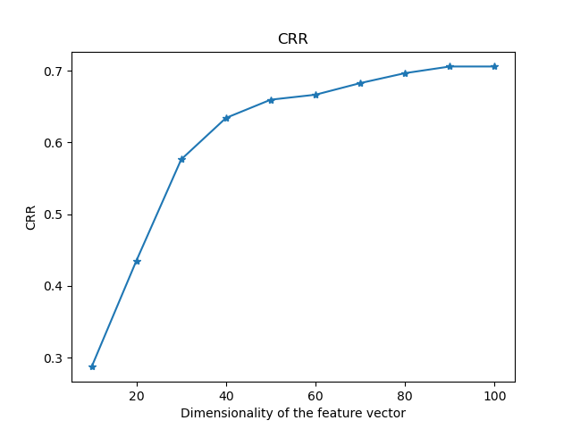
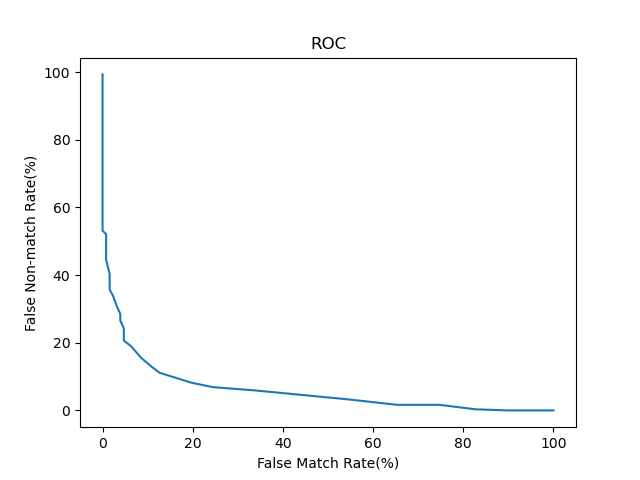

## 1. Code walkthrough

### IrisRecognition.py:

* Main function for the IrisRecognition
* Steps as below
  * Using `glob` function to read train and test dataset from files
  * Preprocess image follow the instruction from paper
  * Apply iris recognition to the test dataset through different distance measure method
  * Do the final performance evaluation

### IrisLocalization.py
This function detects pupil and outer boundary of iris.  
It finds the center of pupil by iteratively find the coordinate of lowest pixel value over a smaller region, and find contours using Canny edge detection and Hugh transformation.

### IrisNormalization.py
This function normalize iris to a 64 * 512 band using the formula proposed in the paper.

### IrisEnhancement.py
This function enhances the normalized image in each 32 * 32 block individually.  
The enhancement shifts the 32 * ️32 block for an arbitrary number of pixels. We tuned the parameter to 8 which produce the best performance.

### FeatureExtraction.py
* `filter_kernal` & `Gabor_filter` define the filter for the image according to the paper
* Use filter with fixed size to transform the image into a vector

### IrisMatching.py:
* `dim_reduction` uses to reduce the dimensionality. Three different methods mentioned - LDA,PCA and without and deduction
* `minimal_offset_distance` calculate different distance between test vector and trained vector. Both different offset and distance measurement considered.
  * Smallest distance will be chosen as the final matching through index, which we can get while reading images.

### PerformanceEvaluation.py:
* `crr` and `roc` will calculate the final result in accordance with definition

**More detailed information can be found in the python code file.**

## 2. Final Performance

### Accuracy Table
Similarity measure | Original feature set |Reduced feature set
------------------------- | ---------------------- | ---------------------
L1 distance measure       |           0.7269       |          0.6412
L2 distance measure       |          0.6852        |        0.6829
Cosine similarity measure |          0.6644        |       0.7546

  Threshold  |  False match rate(%)  |  False non-match rate(%)
-----------  | --------------------- | -------------------------
       0.42   |             0           |         43.9024
       0.44   |            0.9615       |        39.6341
       0.45   |              0.9615     |        36.8902
       0.46   |              0.9615     |        32.6220
### CRR

### ROC

## 3. Limitation and Improvement

1. Our irisEnhancement currently are not considering the background illumination which may hurt our overall performance. Maybe we can try out add background illumination in the future.
2. We use a constant to detect the outer bound for iris which may result in the limitation use of the model. We can try to use other method or other standard to tell with circle refers to iris and which to pupil.
3. Since there are a lot of parameter provided in the paper, we have not fully tuned the model, which means there should be more improvements we can achieve. 

## 4. Peer Evaluation

Content | Contributor
------------ | -------------
IrisRecognition.py | Lihui Pan
IrisLocalization.py | Ningxin Li, Lihui Pan
IrisNormalization.py | Ningxin Li
ImageEnhancement.py | Ningxin Li
FeatureExtraction.py | Lihui Pan
IrisMatching.py | Lihui Pan
PerformanceEvaluation.py | Lihui Pan
Organize & Tunning & Comment | Lihui Pan